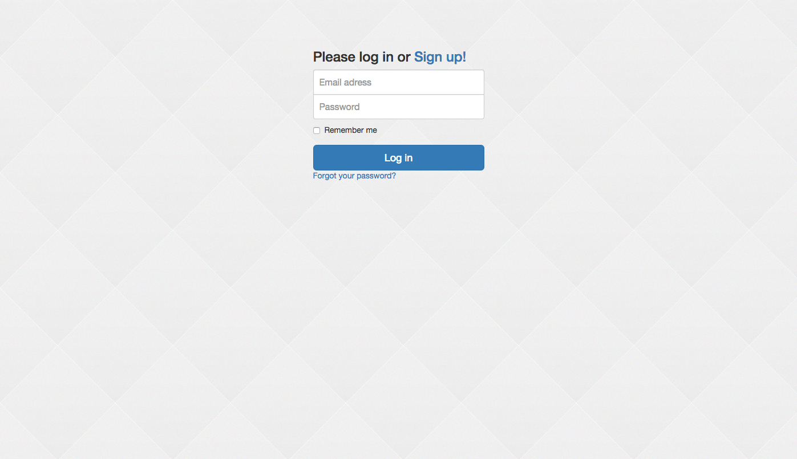

## Login With Devise & Simple Form



--

`app/views/devise/sessions/new.html.erb`
```erb
<%= simple_form_for(resource, as: resource_name, url: session_path(resource_name), html: {class: "form-signin"}) do |f| %>
  <h3 class="form-signin-heading">Please log in or <%= link_to "Sign up!", new_registration_path(resource_name) %></h3>
    <label class="sr-only" for="inputEmail">Email address</label>
    <%= f.input_field :email, required: false, autofocus: true, class: "form-control", placeholder: "Email adress", label: false %>
    <label class="sr-only" for="inputPassword">Password</label>
    <%= f.input_field :password, required: false, placeholder: "Password", class: "form-control", label: false %>
    <div class="checkbox">
      <%= f.input :remember_me, as: :boolean if devise_mapping.rememberable? %>
    </div>
    <%= f.button :submit, "Log in", class: "btn btn-lg btn-primary btn-block" %>

    <%= render "devise/shared/links" %>
<% end %>

```

--

`app/assets/stylesheets/application.css.scss`

```scss
.form-signin {
  max-width: 330px;
  padding: 15px;
  margin: 0 auto;
  .form-signin-heading {
    margin-bottom: 10px;
  }

  .checkbox {
    margin-bottom: 10px;
    font-weight: normal;
  }

  .form-control {
    position: relative;
    height: auto;
    box-sizing: border-box;
    padding: 10px;
    font-size: 16px;
    &:focus {
      z-index: 2;
    }
  }

  input[type="email"] {
    margin-bottom: -1px;
    border-bottom-right-radius: 0;
    border-bottom-left-radius: 0;
  }

  input[type="password"] {
    margin-bottom: 10px;
    border-top-left-radius: 0;
    border-top-right-radius: 0;
  }
}.form-signin {
  max-width: 330px;
  padding: 15px;
  margin: 0 auto;
  .form-signin-heading {
    margin-bottom: 10px;
  }

  .checkbox {
    margin-bottom: 10px;
    font-weight: normal;
  }

  .form-control {
    position: relative;
    height: auto;
    box-sizing: border-box;
    padding: 10px;
    font-size: 16px;
    &:focus {
      z-index: 2;
    }
  }

  input[type="email"] {
    margin-bottom: -1px;
    border-bottom-right-radius: 0;
    border-bottom-left-radius: 0;
  }

  input[type="password"] {
    margin-bottom: 10px;
    border-top-left-radius: 0;
    border-top-right-radius: 0;
  }
}
```