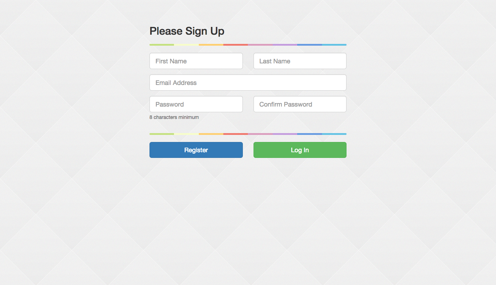

## Register With Devise & Simple Form



--

`app/views/devise/registrations/new.html.erb`

```erb
<div class="container">
  <div class="row">
      <div class="col-xs-12 col-sm-8 col-md-6 col-sm-offset-2 col-md-offset-3">
        <%= simple_form_for(resource, as: resource_name, url: registration_path(resource_name)) do |f| %>
        <h2>Please Sign Up</h2>
        <hr class="colorgraph">
        <div class="row">
          <%= f.error_notification %>
          <div class="col-xs-12 col-sm-6 col-md-6">
            <div class="form-group">
              <%= f.input :first_name, required: true, input_html: { class: "input-lg" }, label: false, placeholder: "First Name" %>
            </div>
          </div>
          <div class="col-xs-12 col-sm-6 col-md-6">
            <div class="form-group">
              <%= f.input :last_name, required: true, input_html: { class: "input-lg" }, label: false, placeholder: "Last Name" %>
            </div>
          </div>
        </div>
        <div class="form-group">
          <%= f.input :email, required: true, autofocus: true, input_html: { class: "input-lg" }, label: false, placeholder: "Email Address" %>
        </div>
        <div class="row">
          <div class="col-xs-12 col-sm-6 col-md-6">
            <div class="form-group">
              <%= f.input :password, required: true, hint: ("#{@minimum_password_length} characters minimum" if @validatable), label: false, input_html: { class: "input-lg" }, placeholder: "Password" %>
            </div>
          </div>
          <div class="col-xs-12 col-sm-6 col-md-6">
            <div class="form-group">
              <%= f.input :password_confirmation, required: true, label: false, input_html: { class: "input-lg" }, placeholder: "Confirm Password" %>
            </div>
          </div>
        </div>
        
        <hr class="colorgraph">
        <div class="row">
          <div class="col-xs-12 col-md-6">
            <%= f.button :submit, "Register", class: "btn btn-primary btn-block btn-lg" %>
          </div>
          <div class="col-xs-12 col-md-6">
            <%= link_to "Log In", new_user_session_path, class: "btn btn-success btn-block btn-lg" %>
          </div>
        </div>
      <% end %>
    </div>
  </div>
</div>
```

--

`app/assets/stylesheets/application.css.scss`

```css
.colorgraph {
  height: 5px;
  border-top: 0;
  background: #c4e17f;
  border-radius: 5px;
  background-image: -webkit-linear-gradient(left, #c4e17f, #c4e17f 12.5%, #f7fdca 12.5%, #f7fdca 25%, #fecf71 25%, #fecf71 37.5%, #f0776c 37.5%, #f0776c 50%, #db9dbe 50%, #db9dbe 62.5%, #c49cde 62.5%, #c49cde 75%, #669ae1 75%, #669ae1 87.5%, #62c2e4 87.5%, #62c2e4);
  background-image: -moz-linear-gradient(left, #c4e17f, #c4e17f 12.5%, #f7fdca 12.5%, #f7fdca 25%, #fecf71 25%, #fecf71 37.5%, #f0776c 37.5%, #f0776c 50%, #db9dbe 50%, #db9dbe 62.5%, #c49cde 62.5%, #c49cde 75%, #669ae1 75%, #669ae1 87.5%, #62c2e4 87.5%, #62c2e4);
  background-image: -o-linear-gradient(left, #c4e17f, #c4e17f 12.5%, #f7fdca 12.5%, #f7fdca 25%, #fecf71 25%, #fecf71 37.5%, #f0776c 37.5%, #f0776c 50%, #db9dbe 50%, #db9dbe 62.5%, #c49cde 62.5%, #c49cde 75%, #669ae1 75%, #669ae1 87.5%, #62c2e4 87.5%, #62c2e4);
  background-image: linear-gradient(to right, #c4e17f, #c4e17f 12.5%, #f7fdca 12.5%, #f7fdca 25%, #fecf71 25%, #fecf71 37.5%, #f0776c 37.5%, #f0776c 50%, #db9dbe 50%, #db9dbe 62.5%, #c49cde 62.5%, #c49cde 75%, #669ae1 75%, #669ae1 87.5%, #62c2e4 87.5%, #62c2e4);
}
```